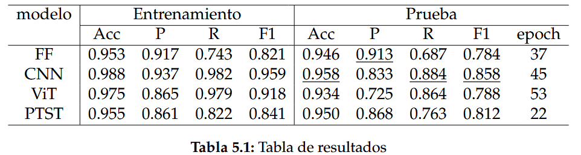

# Trabajo Fin de Máster #
Máster Universitario en Lógica, Computación e Inteligencia Artificial

Universidad de Sevilla

Autor: Alejandro Moreno Guerrero

El propósito de este trabajo es automatizar el trabajo de detección de fallos en series temporales de radiación solar. Para ello se han utilizado técnicas de Deep Learning y se han comparado los resultados para cada una de ellas.

Las series temporales están formadas por las mediciones diarias de tres pirheliómetros de una planta solar. La siguiente imagen muestra un ejemplo de las series temporales. En este ejemplo, los modelos deben identificar que las series temporales de los sensores S1 y S4 son válidas y que la del sensor S3 es inválida.

## Modelos ##

Los modelos de Deep Learning implementados son los siguientes:

- Red feed-forward
- Red neuronal convolucional
- Transformer de visión (ViT)
- Transformer PatchTST

## Tecnologías utilizadas ##

Prácticamente todo el proyecto se ha escrito en Python. Para elaborar los gráficos se ha utilizado la librería matplotlib. Para el diseño, el entrenamiento y la evaluación de los modelos se ha utilizado la librería PyTorch.

## Archivos ##

El notebook `main.ipynb` contiene todo el flujo de trabajo del entrenamiento y la evaluación de los modelos. Las funciones para tomar el conjunto de datos y llegarlo a almacenar en una estructura de datos se encuentran en el archivo `get_dataset.py`. Para decidir los hiperparámetros a utilizar en cada modelo, estos se han buscado por medio de optimización bayesiana. El código utilizado para ello se encuentra en `optimization.ipynb`. Por último, se ha optimizado el umbral de clasificación para cada modelo en función de sus rendimientos reales. El notebook utilizado para ello es `optimization.ipynb`.

Los modelos utilizados se encuentran en los archivos `ff.py`, `cnn.py`, `vit.py` y `transformers/models/patchtst/modeling_patchtst.py`.

Por otra parte, el notebook `ejemplo.ipynb` contiene un ejemplo de uso de Pytorch más simple, en el que se basa la clasificación de las series temporales. En este caso se utiliza la librería MNIST.

## Resultados ##

En la siguiente tabla se pueden ver los resultados obtenidos por cada uno de los modelos:

Donde:

- Acc es Accuracy
- P es Precisión
- R es Recall

## Créditos ##

Código de los siguientes repositorios ha sido utilizado para este proyecto:

- https://github.com/lucidrains/vit-pytorch/blob/main/vit_pytorch/vit.py
- https://github.com/huggingface/transformers/tree/main/src/transformers/models/patchtst
