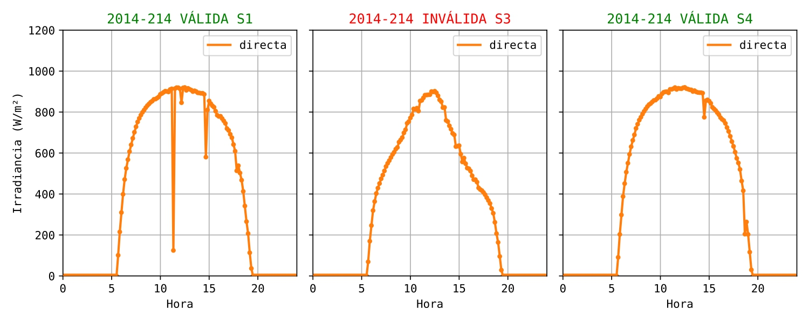

# Trabajo Fin de Máster #
Máster Universitario en Lógica, Computación e Inteligencia Artificial

Universidad de Sevilla

Author: Alejandro Moreno Guerrero

This repository contains files from this project

Code from the following sources has been used and modified for this project:

https://github.com/lucidrains/vit-pytorch/blob/main/vit_pytorch/vit.py
https://github.com/huggingface/transformers/tree/main/src/transformers/models/patchtst

